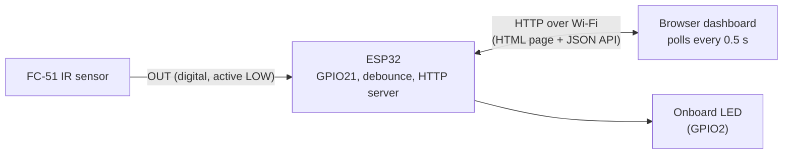

# ESP32-IR-Obstacle-Monitor

**A self-hosted, real-time web dashboard for an infrared obstacle sensor, running entirely on an ESP32 with no cloud, no apps and no external libraries.**


<p align=center>
    
    
</p>

<p align=center>


</p>
<p align=center>


</p>


## Overview

The ESP32 reads an **FC-51 IR obstacle sensor**, debounces the signal, and serves a live dashboard over local Wi-Fi from its own flash memory. Any phone or laptop on the same network can open the page to see whether an obstacle is present, watch detection statistics update in real time, and **switch the sensor input on or off remotely** without reflashing the board.

It is built from the ground up on a raw `WiFiServer` socket: HTTP requests are parsed by hand, the REST-style API is hand-written, and the whole front end (HTML, CSS and JavaScript) is embedded in the firmware. The page needs no internet connection and no third-party code.

This project is the sensing and remote-control layer for a larger goal: an obstacle-avoiding robot base.

## Features

- **Live status** of the sensor (path clear or obstacle detected), refreshed twice a second
- **Remote enable/disable** of the sensor input from the browser
- **Detection statistics**: total detections, time since the last detection and device uptime
- **Software debouncing** that removes the flicker caused by signals sitting at the sensor's detection threshold
- **JSON API** (`/api/status`, `/api/sensor/on`, `/api/sensor/off`) that other tools and scripts can call
- **Resilient UI**: shows a clear "Connection lost" state and recovers automatically
- **Responsive, dark-themed design** that works on phones and desktops, with reduced-motion support
- **Zero external dependencies**: only the `WiFi.h` library bundled with the ESP32 board package
- **Onboard LED indicator** that mirrors the detection state

## Dashboard states

| State | Ring colour | Meaning |
|---|---|---|
| Path clear | Green | Sensor enabled, nothing detected |
| Obstacle detected | Red, pulsing | Sensor enabled, object in range |
| Sensor off | Grey | Input disabled from the dashboard |
| Connection lost | Grey, "Offline" badge | Browser cannot reach the ESP32 |

## System architecture



1. The FC-51 pulls its `OUT` pin **LOW** when its photodiode receives reflected IR light.
2. The ESP32 samples the pin continuously, debounces it, and updates its internal state (detected or clear, counters, timestamps).
3. A browser requests `/` once to load the dashboard, then calls `/api/status` every 500 ms to refresh it.
4. Toggling the switch calls `/api/sensor/on` or `/api/sensor/off`, which changes the firmware state immediately.

## Hardware

| Component | Qty | Notes |
|---|---|---|
| ESP32 DevKit (30-pin, ESP32-WROOM-32) | 1 | Any ESP32 dev board works |
| FC-51 IR obstacle sensor module | 1 | Digital output, adjustable range |
| Jumper wires | 3 | |
| Breadboard | 1 | Optional |
| Micro-USB or USB-C data cable | 1 | Must carry data, not charge-only |

### Wiring

| FC-51 pin | ESP32 pin |
|---|---|
| VCC | **3V3** |
| GND | GND |
| OUT | **GPIO21** |

> **Power the sensor from 3V3, not 5V/VIN.** ESP32 GPIO pins are not 5V tolerant. A module powered at 5V can drive `OUT` to 5V and damage the board.

Many FC-51 modules are printed **OUT, GND, VCC**. Wire by the labels printed on your module, not by position.


## Quick start

1. Install the **Arduino IDE** and the **esp32 by Espressif** board package (version 3.x).
2. Wire the sensor as shown above.
3. Open `firmware/esp32-ir-obstacle-monitor/esp32-ir-obstacle-monitor.ino` and enter your Wi-Fi details:
   ```cpp
   const char* ssid     = "YOUR_WIFI_NETWORK_NAME";
   const char* password = "YOUR_WIFI_PASSWORD";
   ```
4. Select **ESP32 Dev Module** and the correct port, then upload.
5. Open Serial Monitor at **115200 baud** and press the **EN** button. The ESP32 prints its address:
   ```
   Open this address in your browser: http://192.168.1.45
   ```
6. Open that address on any device connected to the same Wi-Fi network.

New to ESP32 or Arduino? Follow the step-by-step **[Beginner's Guide](docs/beginner-guide.md)**.

> **Wi-Fi note:** the ESP32 connects to **2.4 GHz** networks only. It cannot join 5 GHz-only networks.

## Usage

- Hold your hand or a sheet of white paper about 10 cm in front of the sensor. The ring turns red, the counter increases and the onboard LED lights.
- Use the **Sensor input** switch to ignore the sensor. While it is off, nothing is detected or counted, and the dashboard shows "Sensor off".
- Adjust the blue potentiometer on the FC-51 to change the detection range (roughly 2 to 30 cm). Turn it clockwise to increase range.

## API reference

All endpoints use `GET` and return JSON, except `/` which returns the dashboard.

| Endpoint | Description |
|---|---|
| `/` | Dashboard page |
| `/api/status` | Current sensor state and statistics |
| `/api/sensor/on` | Enable sensor input, returns the new status |
| `/api/sensor/off` | Disable sensor input, returns the new status |

Example response:

```json
{"enabled":true,"obstacle":false,"count":3,"lastAgo":12,"uptime":845}
```

| Field | Type | Description |
|---|---|---|
| `enabled` | boolean | Whether the sensor input is being read |
| `obstacle` | boolean | `true` while an obstacle is detected |
| `count` | integer | Detections since boot |
| `lastAgo` | integer | Seconds since the last detection, or `-1` if none yet |
| `uptime` | integer | Seconds since boot |

Example from a terminal:

```bash
curl http://192.168.1.45/api/status
curl http://192.168.1.45/api/sensor/off
```

## Configuration

Constants at the top of the sketch:

| Constant | Default | Purpose |
|---|---|---|
| `ssid`, `password` | placeholders | Wi-Fi credentials |
| `SENSOR_PIN` | `21` | GPIO connected to the FC-51 `OUT` pin |
| `LED_PIN` | `2` | Indicator LED (onboard LED on most DevKits) |
| `DEBOUNCE_MS` | `40` | How long the signal must be stable before the state changes |
| `CLIENT_TIMEOUT_MS` | `400` | Maximum wait for a browser's request before dropping the connection |

## Engineering notes

**Non-blocking sensing.** The sensor is sampled on every pass of `loop()` and also while the server waits for a browser to send its request. A slow or idle client therefore cannot cause a detection to be missed.

**Software debouncing.** The reflected IR signal can hover around the comparator's threshold, which makes the raw output flicker. The firmware only accepts a new state after the signal has been stable for `DEBOUNCE_MS`, using `millis()` timestamps instead of blocking delays.

**Bounded request handling.** Browsers sometimes open idle "pre-connect" sockets. A 400 ms client timeout stops those from stalling the main loop. The request line is read once and routed, instead of matching strings character by character.

**Self-contained front end.** The dashboard is a raw string literal stored in flash. It uses system fonts and inline SVG, so it loads instantly on a local network with no internet access.

**Robust client.** The page polls with an `AbortController` timeout, never overlaps requests, pauses polling when the tab is hidden, and shows a clear offline state after repeated failures.

**Network behaviour.** Wi-Fi power saving is disabled for lower response latency, and the firmware retries the connection if Wi-Fi drops.

**Hardware bring-up lessons.** Two real issues came up while testing: a status LED that flickered when an object sat right at the detection threshold (fixed by recalibrating the potentiometer and adding debouncing), and an input stuck LOW because of a wiring and pin mismatch (diagnosed with a raw `digitalRead` sketch and by touching the pin to 3V3 and GND). The [Beginner's Guide](docs/beginner-guide.md) includes these as troubleshooting steps.

## Project structure

```
.
├── README.md
├── docs/
│   └── beginner-guide.md
├── images/
│   ├── schematic.svg
│   └── dashboard.png
└── firmware/
    └── esp32-ir-obstacle-monitor/
        └── esp32-ir-obstacle-monitor.ino
```

## Security notes

- **Never commit your real Wi-Fi password.** Keep the placeholders in the committed sketch.
- The server uses plain HTTP with no authentication, so anyone on the same Wi-Fi network can open the dashboard and flip the switch. It is designed for a trusted home or lab network. **Do not expose it to the internet.**
- State-changing routes use `GET` for simplicity. A production design would use `POST` plus authentication.

## Limitations

- The FC-51 gives a yes/no result only, not a distance.
- Dark or black surfaces absorb infrared and are detected at shorter range or missed. Strong sunlight can cause false detections.
- The sensor sees only a narrow cone straight ahead.
- The server handles one request at a time, which is fine for a few viewers but not for many.
- Statistics are kept in RAM and reset on reboot.

## Roadmap

- [ ] Push updates with Server-Sent Events or WebSockets instead of polling
- [ ] Authentication and a `POST` based control API
- [ ] Persist settings and counters across reboots
- [ ] Friendly hostname via mDNS (for example `ir-monitor.local`)
- [ ] Add an ultrasonic sensor for real distance readings
- [ ] Add an L298N motor driver and a state machine for an obstacle-avoiding robot
- [ ] Over-the-air (OTA) firmware updates

## Skills demonstrated

Embedded C++ on ESP32, GPIO and digital sensor interfacing, signal debouncing, non-blocking firmware design, hand-written HTTP server and REST-style API, responsive front-end development (HTML, CSS, JavaScript), hardware debugging, circuit documentation and technical writing.

## License

Released under the MIT License.

## Author

Built by [BRAHAAND](https://github.com/BRAHAAND). Based on the author's earlier [esp32-web-server](https://github.com/BRAHAAND/esp32-web-server) project.

## Demonstration

https://github.com/user-attachments/assets/c3ffeeef-9a4d-4c86-80bd-61703f33853b
